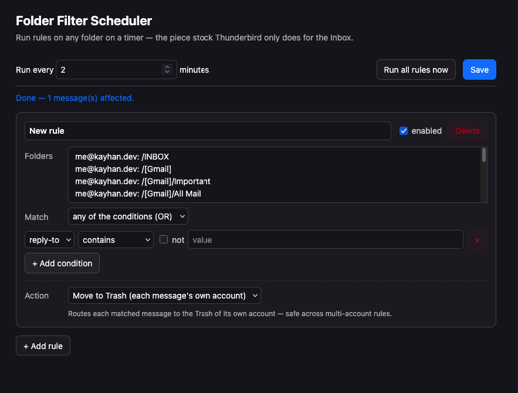
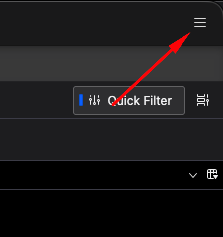
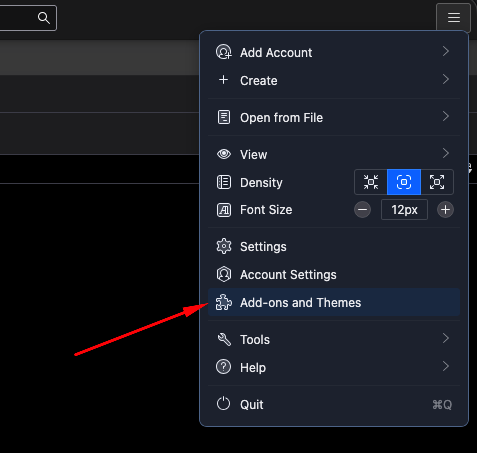
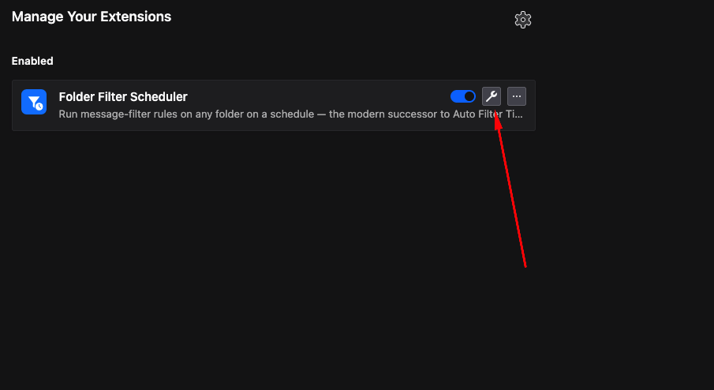

# Folder Filter Scheduler

A Thunderbird [MailExtension](https://webextension-api.thunderbird.net/) that runs
message-filter rules on **any folder, on a schedule** — the piece stock Thunderbird
only does for the Inbox.

[](https://github.com/KayhanB21/folder-filter-scheduler/actions/workflows/ci.yml)
[](https://www.mozilla.org/MPL/2.0/)



## The gap this fills

Thunderbird's message filters can only run **automatically** on the Inbox. The
"Periodically, every N minutes" and "Getting New Mail" triggers never touch other
folders — so mail a provider files **server-side** into Junk/Bulk (where Inbox
filters never see it) can't be auto-processed by a filter at all.

The one add-on that solved this, **Auto Filter Timer**, was last updated in **2018**
and is a legacy overlay extension — it cannot load on any modern Thunderbird. There
is a standing [Mozilla Connect feature request](https://connect.mozilla.org/t5/ideas/thunderbird-please-add-possibility-to-run-message-filters/idi-p/53705)
asking for native non-Inbox filter scheduling. This project is the modern,
WebExtension-era replacement.

### Real-world motivation

A recurring spam campaign rotated its `From` address every wave but kept a constant
`Reply-To: spammer@example.com`. Yahoo files it server-side into **Bulk**,
so an Inbox filter never runs on it. Folder Filter Scheduler watches the Bulk folder
on a timer, matches on `Reply-To`, and moves matches to Trash automatically.

## A deliberate design decision (and the constraint behind it)

You might expect this add-on to simply *re-run your existing Thunderbird filters* on
another folder. **It can't** — and neither can any modern add-on. The MailExtension
API exposes no hook to invoke Thunderbird's built-in message-filter engine on demand.

So instead of pretending, this add-on ships its **own** rule engine: it reimplements
condition matching ([`src/matcher.js`](src/matcher.js)) and the actions
([`src/background.js`](src/background.js)), and drives them from the `alarms` API.
The matcher is a pure, dependency-free module so the matching logic is unit-tested
under plain Node, with no Thunderbird needed — see [`test/matcher.test.js`](test/matcher.test.js).

## Features

- **Conditions** on `from`, `to`, `cc`, `subject`, `reply-to`, `list-id`, `sender`
  with `contains` / `is` / `starts with` / `ends with` / `matches regex`, each
  optionally negated, combined with AND or OR.
- **Actions**: move to Trash, move/copy to a chosen folder (**including a folder
  in a different account** — e.g. Yahoo Bulk → Outlook Trash), mark read /
  flagged / junk, or delete permanently. Actions live in a single
  [registry](src/actions.js) that drives both the engine and the UI, so adding
  one is a one-entry change.
- **Multiple source folders per rule**, spanning multiple accounts — one rule can
  watch Yahoo Bulk *and* Outlook Junk at once, and "Move to Trash" routes each
  match to its own account's Trash.
- **Any folder, on a timer** — not just the Inbox.
- **Lazy fetching**: a rule that only uses `from`/`to`/`cc`/`subject` reads the
  free indexed header and downloads nothing; only `reply-to`/`list-id`/`sender`
  rules pay for a full message fetch. Offline storage is therefore a performance
  choice, not a requirement.
- **Run now** button for immediate, on-demand runs.

## Install (temporary / development)

1. Clone this repo.
2. In Thunderbird: **Tools → Developer Tools → Debug Add-ons**.
3. **Load Temporary Add-on…** and pick `manifest.json`.

A signed `.xpi` for permanent install will follow once published to
[addons.thunderbird.net](https://addons.thunderbird.net).

## Using it

### 1. Open the options page

Open the Thunderbird menu (☰, top-right):



Choose **Add-ons and Themes**:



Find **Folder Filter Scheduler** and click the **wrench / options** button:



### 2. Create a rule


- **Run every** — how often the schedule fires (in minutes).
- **Folders** — pick one or more source folders (Cmd-click to multi-select). They
  can span multiple accounts.
- **Match** — `any` (OR) or `all` (AND) of the conditions below.
- **Condition** — e.g. `reply-to` · `contains` · a value. Tick **not** to negate.
- **Action** — e.g. *Move to Trash (each message's own account)*. The hint line
  under it explains exactly where matches go.

Click **Save**, then **Run all rules now** to test immediately — the status line
reports how many messages were affected (e.g. *"Done — 1 message(s) affected."*).

> **Header matching and offline storage.** Conditions on `from`/`to`/`cc`/`subject`
> read the indexed header and need no download. Conditions on `reply-to` (or other
> non-indexed headers) require the full message: on an online IMAP folder it is
> fetched on demand, so it works either way. For speed and offline use, enable
> offline storage for the folder (Account Settings → Synchronization & Storage) and
> run **Repair Folder** once.

## Develop

```bash
npm test     # run the matcher unit tests (Node's built-in test runner)
npm run lint # syntax-check the sources
```

No dependencies — Node 18+ only. The matcher is intentionally isolated from the
extension APIs precisely so it stays this easy to test.

## Compatibility

Targets Thunderbird **128+** (uses the folder-`id`-based messages API). Built and
tested against Thunderbird 152.

## License

[MPL-2.0](LICENSE) — the same license Thunderbird itself uses.
