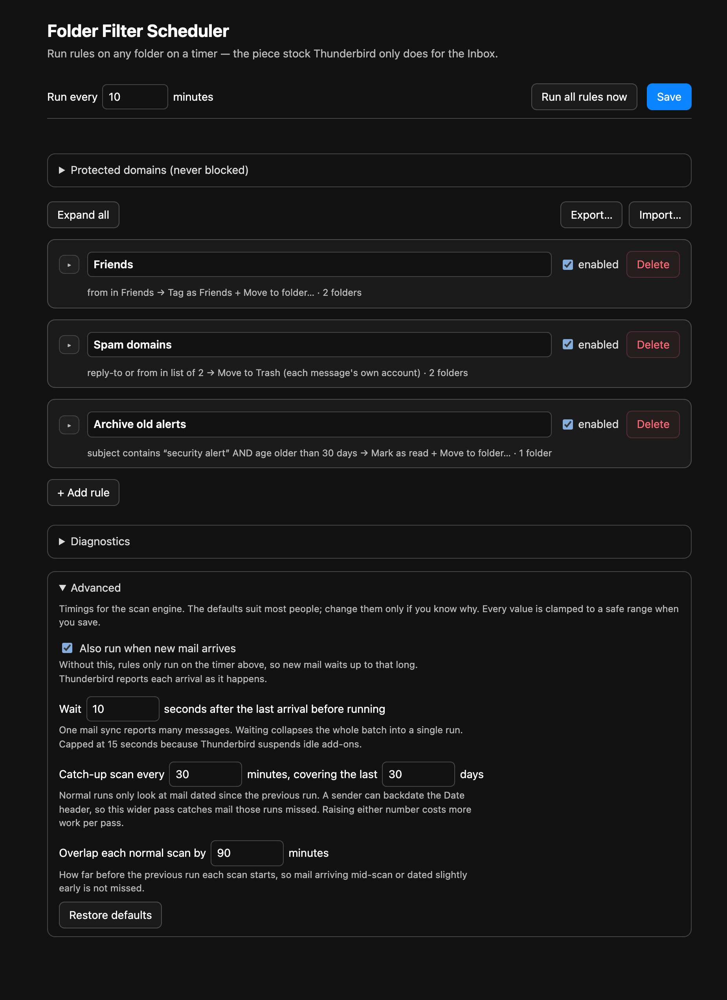

# Folder Filter Scheduler

A Thunderbird [MailExtension](https://webextension-api.thunderbird.net/) that runs
message-filter rules on **any folder, on a schedule** — the piece stock Thunderbird
only does for the Inbox.

[](https://github.com/KayhanB21/folder-filter-scheduler/actions/workflows/ci.yml)
[](https://www.mozilla.org/MPL/2.0/)


## The gap this fills

Thunderbird's message filters can only run **automatically** on the Inbox. The
"Periodically, every N minutes" and "Getting New Mail" triggers never touch other
folders — so mail a provider files **server-side** into Junk/Bulk (where Inbox
filters never see it) can't be auto-processed by a filter at all.

The one add-on that solved this, **Auto Filter Timer**, was last updated in **2018**
and is a legacy overlay extension — it cannot load on any modern Thunderbird. There
is a standing [Mozilla Connect feature request](https://connect.mozilla.org/t5/ideas/thunderbird-please-add-possibility-to-run-message-filters/idi-p/53705)
asking for native non-Inbox filter scheduling. This project is the modern,
WebExtension-era replacement.

## A deliberate design decision (and the constraint behind it)

You might expect this add-on to simply *re-run your existing Thunderbird filters* on
another folder. **It can't** — and neither can any modern add-on. The MailExtension
API exposes no hook to invoke Thunderbird's built-in message-filter engine on demand.

So instead of pretending, this add-on ships its **own** rule engine: it reimplements
condition matching ([`src/matcher.js`](src/matcher.js)) and the actions
([`src/background.js`](src/background.js)), and drives them from the `alarms` API.
The matcher is a pure, dependency-free module so the matching logic is unit-tested
under plain Node, with no Thunderbird needed — see [`test/matcher.test.js`](test/matcher.test.js).

## Features

- **Conditions** on `from`, `to`, `cc`, `subject`, `reply-to`, `list-id`, `sender`
  with `contains` / `is` / `starts with` / `ends with` / `matches regex`, each
  optionally negated, combined with AND or OR.
- **Age conditions**: `age` · `older than` / `newer than` · N days, for rules like
  "move security alerts to Archive after 30 days". Something the built-in
  retention policy cannot express, since it can only delete.
- **Address-book conditions**: `from` / `reply-to` / `sender` / `to` / `cc` · `is in address
  book` · one book or all of them, negatable. "Move mail from people I don't know
  out of this folder" becomes one condition. Access to address books is an
  optional permission, asked for only when you use it.
- **Diagnostics**: a report you can copy or save from the options page, with
  your Thunderbird version, the shape of each rule, and what recent runs did.
  Addresses, domains, patterns and folder names are left out unless you opt in.
- **Actions**: move to Trash, archive with each account's own archive
  settings, move/copy to a chosen folder (**including a folder
  in a different account** — e.g. Yahoo Bulk → Outlook Trash), apply one of your
  Thunderbird tags, mark read / flagged / junk, or delete permanently. Actions
  live in a single [registry](src/actions.js) that drives both the engine and
  the UI, so adding one is a one-entry change.
- **Several actions per rule**: "tag as Friends *and* move to the Friends
  folder" is one rule. The action that consumes the message (move, archive,
  Trash, delete) always runs last, whatever order you put the rows in, because a move
  invalidates the message ids that the other actions need. For the same reason a
  rule may carry only one of those.
- **Multiple source folders per rule**, spanning multiple accounts — one rule can
  watch Yahoo Bulk *and* Outlook Junk at once, and "Move to Trash" routes each
  match to its own account's Trash.
- **Folder picker built for deep trees.** Folders are grouped by account and
  drawn as a tree with dashed guide lines. Type in the filter box to narrow the
  list to matching paths, then press *Select all matching* to pick every one.
  Folders you picked earlier stay picked while you filter.
- **Include subfolders.** Tick it and a rule also scans every folder under the
  ones you picked, including folders you create later. The picker marks those
  folders as included. Two kinds are skipped: a Trash folder, because trashing
  mail already in Trash deletes it for good, and a folder the rule moves or
  copies into, because the rule would scan its own output again.
- **Light or dark.** The options page follows Thunderbird's theme, or you can
  pick Light or Dark with the sun and moon switch in the header.
- **Any folder, on a timer** — not just the Inbox.
- **Runs on new mail too.** Thunderbird reports each arrival through
  `messages.onNewMailReceived`, so a rule fires seconds after mail lands instead
  of waiting out the interval. Arrivals are debounced, so one mail sync causes
  one run, and only the rules watching the folders that got mail are checked.
  The timer stays as the backstop, and the trigger can be turned off under
  **Advanced**.
- **Advanced settings** at the bottom of the options page: the new-mail trigger
  and its debounce, the catch-up interval and lookback, and the incremental scan
  overlap. Every value is clamped to a safe range on save.
- **Lazy fetching**: a rule that only uses `from`/`to`/`cc`/`subject` reads the
  free indexed header and downloads nothing; only `reply-to`/`list-id`/`sender`
  rules pay for a full message fetch. Offline storage is therefore a performance
  choice, not a requirement.
- **Right-click harvesting**: select spam in any folder, choose *Add spam domains to
  Folder Filter Scheduler*, and the extracted sender domains are merged into a
  standing block rule after a confirmation step. Well-known providers (gmail,
  yahoo, outlook, …) are never blocked.
- **Import / export rules** as JSON, so a rule set can be backed up or moved
  between profiles. Imported rules are validated field by field and staged on the
  page for review before anything is stored.
- **Domain-list conditions** that match subdomains automatically (`evil.com` also
  catches `bounce.evil.com`) and hold hundreds of entries in a single editable box.
- **Incremental scheduled scans**: a scheduled run only examines messages that
  arrived since the last one, so a per-message header read stays affordable. A
  catch-up scan of the whole folder every 30 minutes picks up mail whose `Date`
  header lags its real arrival, or that Thunderbird stored with no usable date. **Run all rules now** always scans the whole folder.
- **Run now** button for immediate, on-demand runs.

## Install (temporary / development)

1. Clone this repo.
2. In Thunderbird: **Tools → Developer Tools → Debug Add-ons**.
3. **Load Temporary Add-on…** and pick `manifest.json`.

A signed `.xpi` for permanent install will follow once published to
[addons.thunderbird.net](https://addons.thunderbird.net).

## Using it

### 1. Open the options page

Open the Thunderbird menu (☰, top-right):


Choose **Add-ons and Themes**:


Find **Folder Filter Scheduler** and click the **wrench / options** button:


### 2. Create a rule


- **Run every** — how often the schedule fires (in minutes).
- **Folders** — pick one or more source folders (Cmd-click to multi-select). They
  can span multiple accounts.
- **Match** — `any` (OR) or `all` (AND) of the conditions below.
- **Condition** — e.g. `reply-to` · `contains` · a value. Tick **not** to negate.
  Choosing the `age` field swaps the row to `older than` / `newer than` and a
  number of days. Choosing `is in address book` swaps the value for a book picker;
  the first time, it shows **Allow address book access…** instead.
- **Then** — one or more actions, e.g. *Tag as… Friends* followed by *Move to
  folder…*. The hint line under each explains exactly what it does. **+ Add
  action** adds another; the action that moves or deletes always runs last, so
  the others still see the message. A new action starts on *Choose an action…*
  and the rule cannot be saved until you pick one, so nothing is trashed by
  default. On `to` and `cc`, an address-book condition matches when any
  recipient is in the book; your own address is usually one of them.

### Advanced settings



At the bottom of the options page. The defaults suit most people:

- **Also run when new mail arrives** — on by default. Without it, rules only run
  on the timer, so new mail waits up to that long.
- **Wait N seconds** — one mail sync reports many messages; waiting collapses the
  batch into a single run. Capped at 15 seconds, because Thunderbird suspends an
  idle add-on after about 30.
- **Catch-up scan** — how often the whole-folder pass runs that catches mail
  whose `Date` header lags its real arrival, and how far back a rule that reads
  message headers (such as `Reply-To`) reads them during that pass.
- **Overlap** — how far before the previous run each normal scan starts.

### 3. Or build a block list by right-clicking

Select one or more spam messages, right-click, and choose **Add spam domains to
Folder Filter Scheduler**. The add-on reads each message's `Reply-To` and `From`
headers, extracts the sender domains, drops anything on the protected-domains
list, and shows you what it found. Confirm, and the domains are merged into a rule
named **Spam domains** that moves matches to Trash on the normal schedule.

Two things worth knowing:

- The dialog groups domains by the header they came from. `Reply-To` is harder to
  forge on bulk mail, but plenty of spam carries none at all, so `From` is
  harvested too and shown separately: a `From` domain can be forged to impersonate
  a real company, so uncheck anything you do not recognise before adding.
- The protected-domains list (editable on the options page) means this will not
  block mail from gmail, yahoo, outlook and similar. That is deliberate: blocking
  a whole provider would discard far more legitimate mail than spam.

### Backing up and moving rules

**Export…** writes the current rules, protected-domains list, and interval to a
JSON file named with the local date and time
(`ffs-rules-2026-08-24-2013.json`), so successive backups sit
side by side in chronological order instead of overwriting each other. **Import…** validates such a file and stages the rules on the page for
review; nothing is stored until you press **Save**. Anything unrecognised (an
unknown action, an empty domain list, a folder that does not exist in this
profile) is dropped and reported rather than imported.

Each rule carries a short **hash** of what it does — its folders, conditions, and
actions, ignoring its name. Importing a rule whose hash already exists skips it and
says which rule it duplicates, so re-importing the same file is a no-op instead of
a way to accumulate copies. Renaming a rule does not change its hash.

Rules can also be **collapsed** to a one-line summary, individually or with
**Collapse all**. That is a view preference stored in the browser only: it never
changes what is saved or exported.

Click **Save**, then **Run all rules now** to test immediately — the status line
reports how many messages were affected (e.g. *"Done — 1 message(s) affected."*).

> **Speed of `Reply-To` rules.** A rule matching a non-indexed header reads the
> headers of each candidate message. Scheduled runs are incremental, so in steady
> state that is only the newly arrived mail; the periodic catch-up scan (every 30
> minutes, reading the last 30 days plus any message without a usable date) and
> every manual run cover more. Enabling offline
> storage for the folder makes this local and much faster.

> **Age conditions and scanning.** Age is measured from the message's `Date`
> header, the same value Thunderbird's own "Age in Days" filter and folder
> retention policy use. A rule with an age condition cannot be scanned
> incrementally (a message that turns 30 days old today arrived 30 days ago), so
> such rules always look at the whole folder. When the rule uses **all** with
> `older than N`, only the part of the folder older than N days is queried, which
> is the part a move action drains, so steady state stays cheap.

> **Address-book conditions and safety.** Books are read once per run. A
> condition whose book cannot be read, is empty, or was deleted **never matches**,
> negated or not, and so does a message with no usable sender address. That is
> what keeps "From is not in my address book → Trash" from emptying a folder
> when a book fails to load. With "All address books", one unreadable book makes
> the whole condition inert rather than treating its contacts as strangers.
> Remote (LDAP) books cannot be enumerated and are skipped.

> **Header matching and offline storage.** Conditions on `from`/`to`/`cc`/`subject`
> read the indexed header and need no download. Conditions on `reply-to` (or other
> non-indexed headers) require the full message: on an online IMAP folder it is
> fetched on demand, so it works either way. For speed and offline use, enable
> offline storage for the folder (Account Settings → Synchronization & Storage) and
> run **Repair Folder** once.

## Reporting a problem

Open the options page, expand **Diagnostics** at the bottom, and press **Copy
report** or **Save report…**. Paste it into your email or a
[GitHub issue](https://github.com/KayhanB21/folder-filter-scheduler/issues). The
report shows every scheduled and manual run of the last few hours: which scan
ran, over what date range, how many messages were scanned and matched, and any
errors. It is plain text and shown in full before you send it.

## Develop

```bash
npm test     # run the matcher unit tests (Node's built-in test runner)
npm run lint # syntax-check the sources
```

No dependencies — Node 18+ only. The matcher is intentionally isolated from the
extension APIs precisely so it stays this easy to test.

## Compatibility

Targets Thunderbird **147+**. Version 0.1.x supported 128+; 0.2.0 raised the floor
to use `messengerUtilities.parseMailboxString()` (TB 137+) and
`messages.getHeaders()` (TB 147+), the latter being substantially faster than
`getFull()` for the header-only reads a `Reply-To` rule performs. ESR 140 reached
end of life in August 2026, so supported installations are on 153 or newer.

## Privacy

The add-on collects and transmits nothing — all processing is local. See
[PRIVACY.md](PRIVACY.md).

## License

[MPL-2.0](LICENSE) — the same license Thunderbird itself uses.
